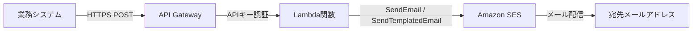

# Amazon SES メール送信 API

API Gateway + Lambda + Amazon SES を使用して、外部の業務システムから API 経由で通知メールを送信する仕組みを AWS CDK (TypeScript) で構築します。

## アーキテクチャ



### 機能

- **自由形式メール送信** (`POST /send`): 件名・本文を自由に指定してメール送信
- **テンプレートメール送信** (`POST /send-template`): SES テンプレートを使用したメール送信
- **APIキー認証**: API Gateway の APIキー + Usage Plan によるアクセス制御・レート制限

## 前提条件

- AWS アカウント
- AWS CLI（設定済み）
- Node.js 18 以上
- AWS CDK CLI (`npm install -g aws-cdk`)


## パラメータ設定

`cdk.json` の `context.sesConfig` セクションを編集してください。**これが設定が必要な唯一のファイルです。**

```json
{
  "context": {
    "sesConfig": {
      "region": "ap-northeast-1",
      "senderEmail": "sender@example.com",
      "apiKeyName": "ses-sending-api-key",
      "stageName": "v1"
    }
  }
}
```

### パラメータ説明

| パラメータ | 必須 | 説明 |
|-----------|------|------|
| `region` | Yes | デプロイ先リージョン（例: `ap-northeast-1`） |
| `senderEmail` | Yes | 送信元メールアドレス（SES で検証済みである必要あり） |
| `apiKeyName` | Yes | API Gateway の API キー名 |
| `stageName` | Yes | API Gateway のステージ名（例: `v1`） |

## デプロイ手順

### 1. 依存パッケージのインストール

```bash
npm install
```

### 2. パラメータ設定

サンプルファイルから `cdk.json` を作成し、`sesConfig` を環境に合わせて編集します。

```bash
cp cdk.json.sample cdk.json
# cdk.json を編集
```

> **注意**: `cdk.json` は `.gitignore` に含まれているため、Git にコミットされません。実際の設定値が誤って公開されることを防いでいます。

### 3. AWS 認証の確認

AWS CLI の認証方法に応じて、以下のいずれかを確認してください。

**環境変数・デフォルト認証の場合:**

```bash
aws sts get-caller-identity
```

**AWS プロファイルを使う場合:**

```bash
# SSO プロファイルの場合は事前にログイン
aws sso login --profile {プロファイル名}

aws sts get-caller-identity --profile {プロファイル名}
```

> 以降のコマンド例では `--profile` なしで記載しています。**AWS SSO 等のプロファイルを使う場合は、各 `aws` コマンド・`npx cdk` コマンドの末尾に `--profile {プロファイル名}` を必ず追加してください。**

### 4. CDK Bootstrap（初回のみ）

デプロイ先リージョンに CDK の初期リソースを作成します。`cdk.json` の `region` が使われるため、アカウントIDやリージョンの指定は不要です。

```bash
npx cdk bootstrap
```

### 5. テンプレート生成・確認（任意）

```bash
npm run build
npx cdk synth
```

### 6. デプロイ

```bash
npx cdk deploy --all --require-approval never
```

デプロイが完了すると、以下の出力が表示されます。`ApiEndpoint` と `ApiKeyId` は後の手順で使用します。

```
Outputs:
SesSendingStack.ApiEndpoint = https://{API ID}.execute-api.{region}.amazonaws.com/{stage}/
SesSendingStack.ApiKeyId = {APIキーID}
```

## デプロイ後の作業

以降の AWS CLI コマンドでは、リージョン・送信元アドレスなどを直接コマンドに記載しています。シェル変数を事前に設定する必要はなく、**各コマンドをそのままコピー＆ペーストで実行できます。**（メールアドレスは `cdk.json` の `sesConfig.senderEmail` に合わせて適宜変更してください。）

### 1. SES メールアドレス検証（必須）

送信元メールアドレス（`cdk.json` の `senderEmail`）を SES で検証します。Sandbox モードでは**送信先メールアドレスも検証が必要**です。

```bash
# 送信元メールアドレスの検証（cdk.json の senderEmail を自動で読み取り）
aws ses verify-email-identity \
  --email-address k-nagayama@dicejreg.onmicrosoft.com \
  --region ap-northeast-1
```

```bash
# 送信先メールアドレスの検証（Sandbox モードの場合、実際の送信先アドレスに置き換えてください）
aws ses verify-email-identity \
  --email-address {送信先メールアドレス} \
  --region ap-northeast-1
```

以下のような検証メールが届くので、メール内のリンクをクリックして承認してください。


リンクをクリックすると、以下の画面が表示されれば検証完了です。


検証状態の確認（`VerificationStatus` が `Success` になっていれば OK です）:

```bash
aws ses get-identity-verification-attributes \
  --identities k-nagayama@dicejreg.onmicrosoft.com {送信先メールアドレス} \
  --region ap-northeast-1
```

出力例:

```json
{
    "VerificationAttributes": {
        "sender@example.com": {
            "VerificationStatus": "Success"
        },
        "recipient@example.com": {
            "VerificationStatus": "Success"
        }
    }
}
```

### 2. API キーの取得（必須）

デプロイ出力の `SesSendingStack.ApiKeyId` に表示された値を `{ApiKeyId}` に置き換えて実行します。

```bash
aws apigateway get-api-key \
  --api-key {ApiKeyId} \
  --include-value \
  --region ap-northeast-1
```

出力の `value` フィールドが API キーです（`id` ではなく `value` を使用してください）。

```json
{
    "id": "xxxxxxxxxx",
    "value": "xxxxxxxxxxxxxxxxxxxxxxxxxxxxxxxxxxxxxxxx",  ← これを使う
    "name": "ses-sending-api-key",
    ...
}
```

## API の使い方

### 自由形式メール送信 (`POST /send`)

以下のプレースホルダーを置き換えて実行してください:

- `{API ID}`: デプロイ出力の `ApiEndpoint` URL に含まれる ID（例: `https://{API ID}.execute-api.…`）
- `{APIキーのvalue}`: 上の手順で取得した API キーの `value`
- `{送信先メールアドレス}`: SES で検証済みの送信先アドレス

```bash
curl -X POST "https://{API ID}.execute-api.ap-northeast-1.amazonaws.com/v1/send" \
  -H "Content-Type: application/json" \
  -H "x-api-key: {APIキーのvalue}" \
  -d '{
    "to": ["{送信先メールアドレス}"],
    "subject": "テスト通知",
    "body": "API Gateway経由でのメール送信テストです。",
    "bodyHtml": "<h1>テスト通知</h1><p>API Gateway経由でのメール送信テストです。</p>"
  }'
```

成功すると `{"messageId":"..."}` が返り、送信先にメールが届きます。

**リクエストボディ:**

| フィールド | 型 | 必須 | 説明 |
|-----------|------|------|------|
| `to` | string[] | Yes | 送信先メールアドレス |
| `subject` | string | Yes | 件名 |
| `body` | string | Yes | 本文（テキスト） |
| `bodyHtml` | string | No | 本文（HTML） |
| `cc` | string[] | No | CC |
| `bcc` | string[] | No | BCC |
| `replyTo` | string[] | No | Reply-To |

### テンプレートメール送信 (`POST /send-template`)

```bash
curl -X POST "https://{API ID}.execute-api.ap-northeast-1.amazonaws.com/v1/send-template" \
  -H "Content-Type: application/json" \
  -H "x-api-key: {APIキーのvalue}" \
  -d '{
    "to": ["{送信先メールアドレス}"],
    "templateName": "NotificationTemplate",
    "templateData": {
      "title": "システムアラート",
      "name": "田中太郎",
      "message": "サーバーの CPU 使用率が 90% を超えました。"
    }
  }'
```

**リクエストボディ:**

| フィールド | 型 | 必須 | 説明 |
|-----------|------|------|------|
| `to` | string[] | Yes | 送信先メールアドレス |
| `templateName` | string | Yes | SES テンプレート名 |
| `templateData` | object | Yes | テンプレート変数 |
| `cc` | string[] | No | CC |
| `bcc` | string[] | No | BCC |
| `replyTo` | string[] | No | Reply-To |

### レスポンス

**成功 (200):**

```json
{
  "messageId": "0100018e-xxxx-xxxx-xxxx-xxxxxxxxxxxx-000000"
}
```

**エラー (400/500):**

```json
{
  "error": "エラーメッセージ"
}
```

### テストツール

ブラウザでメール送信をテストできる HTML ツールを用意しています。

```bash
open tools/send-test.html
```

API Endpoint URL と API Key を入力し、フォームから自由形式メール・テンプレートメールの送信をテストできます。設定値はブラウザの localStorage に保存されるため、次回アクセス時に再入力は不要です。

> **注意**: テンプレートメール送信をテストする場合は、事前に SES テンプレートの登録が必要です。次の「SES テンプレート管理」セクションを参照してください。

## SES テンプレート管理

SES テンプレートは AWS CLI で管理します。サンプルテンプレートが `templates/sample-template.json` にあります。

### テンプレートの登録

```bash
aws ses create-template \
  --cli-input-json file://templates/sample-template.json \
  --region ap-northeast-1
```

### テンプレートの更新

```bash
aws ses update-template \
  --cli-input-json file://templates/sample-template.json \
  --region ap-northeast-1
```

### テンプレート一覧の確認

```bash
aws ses list-templates \
  --region ap-northeast-1
```

### テンプレートの削除

```bash
aws ses delete-template \
  --template-name NotificationTemplate \
  --region ap-northeast-1
```

## SES Sandbox について

新規 AWS アカウントでは SES は Sandbox モードです。Sandbox モードでは以下の制限があります：

- **送信元・送信先の両方**が SES で検証済みのメールアドレスである必要がある
- 1 日あたり 200 通、1 秒あたり 1 通の送信制限

本番運用で任意のアドレスにメールを送信する場合は、SES コンソールから「プロダクションアクセスリクエスト」を申請してください。プロダクションアクセスが承認されると、送信先の検証が不要になり、送信制限も大幅に緩和されます。

## トラブルシューティング

### メール送信が拒否される（MessageRejected）

1. 送信元メールアドレス（`senderEmail`）が SES で検証済みか確認

```bash
aws ses get-identity-verification-attributes \
  --identities k-nagayama@dicejreg.onmicrosoft.com \
  --region ap-northeast-1
```

2. Sandbox モードの場合、送信先メールアドレスも検証済みか確認
3. メールアドレスの形式が正しいか確認

### テンプレートが見つからない（TemplateDoesNotExist）

1. テンプレートが登録されているか確認

```bash
aws ses list-templates \
  --region ap-northeast-1
```

2. テンプレート名が正しいか確認（大文字・小文字を区別します）
3. AWS CLI コマンドで `--profile` の付け忘れがないか確認（プロファイル未指定だと別のアカウント/リージョンに登録されてしまい、対象環境にテンプレートが存在しない状態になります）

### API キーが無効（403 Forbidden）

1. `x-api-key` ヘッダーが正しく設定されているか確認
2. API キーの値（ID ではなく value）を使用しているか確認

### cdk synth でエラーが出る

1. `cdk.json` の `sesConfig` が正しく設定されているか確認
2. `npm run build` でコンパイルエラーがないか確認

## リソース削除

```bash
npx cdk destroy --all
```

SES のメールアドレス検証やテンプレートは CDK 管理外のため、必要に応じて別途削除してください。

```bash
# メールアドレス検証の削除
aws ses delete-identity \
  --identity k-nagayama@dicejreg.onmicrosoft.com \
  --region ap-northeast-1

# テンプレートの削除（登録した場合）
aws ses delete-template \
  --template-name NotificationTemplate \
  --region ap-northeast-1
```

## 料金試算

月 100 通のメール送信を想定した月額料金の試算です（2026年3月時点）。

| サービス | 内訳 | 月額 |
|---------|------|------|
| SES（送信） | 100通（無料枠: 月62,000通 ※EC2経由の場合） | $0.01 |
| API Gateway | 100リクエスト（無料枠: 月100万リクエスト） | $0.00 |
| Lambda | 100回実行 × 128MB × 1秒（無料枠内） | $0.00 |
| CloudWatch Logs | ログ約1MB（無料枠内） | $0.00 |
| **合計** | | **約 $0.01/月** |

> **補足**: Lambda・API Gateway は AWS 無料枠の範囲内で収まるため、実質的なコストは SES の送信料金のみです。送信量が大幅に増加しない限り、月額 $1 未満で運用できます。
