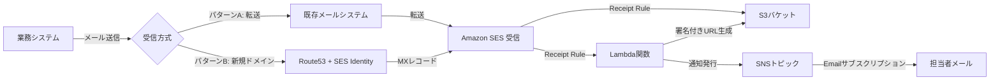

# Amazon SES メール受信セットアップ

Amazon SES を使用してメールを受信し、S3 に保存、署名付き URL を含む通知メールを送信する仕組みを AWS CDK (TypeScript) で構築します。

## アーキテクチャ



### 処理フロー

1. メールが SES で受信される
2. Receipt Rule により S3 バケットにメール本文が保存される
3. Lambda 関数が起動し、S3 の署名付き URL（7日間有効）を生成
4. SNS 経由で担当者に通知メールが送信される（件名・送信者・署名付き URL 含む）

## 前提条件

- AWS アカウント
- AWS CLI（設定済み）
- Node.js 18 以上
- AWS CDK CLI (`npm install -g aws-cdk`)
- SES が利用可能なリージョン（us-east-1, us-west-2, eu-west-1 のいずれか）

## パターン選択ガイド

DNS 管理権限がないドメイン（例: `@jreast.co.jp`）宛のメールを受信するには、以下の 2 つの方法があります。

### パターン A: 既存メールシステムからの転送（推奨）

既存のメールシステム（Exchange, Google Workspace 等）で、対象アドレス宛のメールを SES 管理ドメインに転送します。

| 項目 | 内容 |
|------|------|
| メリット | 新規ドメイン取得不要、既存システムの設定変更のみ |
| デメリット | 既存メールシステムの管理者に転送設定を依頼する必要がある |
| 必要な作業 | SES でドメイン検証（手動）+ 既存システムで転送ルール設定 |

### パターン B: 新規ドメインを取得して SES で受信

Route53 で新規ドメインを取得（または持ち込み）し、SES で直接メールを受信します。

| 項目 | 内容 |
|------|------|
| メリット | 完全に自動構築可能、DNS 設定も CDK で管理 |
| デメリット | ドメイン取得費用が発生、業務システム側のメール送信先変更が必要 |
| 必要な作業 | ドメイン取得 + CDK デプロイのみ |

## パラメータ設定

`cdk.json` の `context.sesConfig` セクションを編集してください。**これが設定が必要な唯一のファイルです。**

```json
{
  "context": {
    "sesConfig": {
      "domainPattern": "forwarding",
      "receiveDomain": "example.com",
      "receiveAddresses": ["notification@example.com"],
      "notificationEmails": ["admin@company.co.jp"],
      "presignedUrlExpiryDays": 7,
      "s3": {
        "bucketNameSuffix": "received-emails",
        "objectKeyPrefix": "incoming/",
        "lifecycleDays": 365
      },
      "newDomain": {
        "domainName": "example.com",
        "createHostedZone": true
      }
    }
  }
}
```

### パラメータ説明

| パラメータ | 必須 | 説明 |
|-----------|------|------|
| `domainPattern` | Yes | `"forwarding"`（パターン A）または `"newDomain"`（パターン B） |
| `receiveDomain` | Yes | SES で受信するドメイン名 |
| `receiveAddresses` | Yes | 受信対象のメールアドレス一覧 |
| `notificationEmails` | Yes | 通知先メールアドレス一覧 |
| `presignedUrlExpiryDays` | Yes | 署名付き URL の有効期限（1〜7日） |
| `s3.bucketNameSuffix` | Yes | S3 バケット名のサフィックス（`{アカウントID}-{サフィックス}` の形式） |
| `s3.objectKeyPrefix` | Yes | メール保存先の S3 キープレフィックス |
| `s3.lifecycleDays` | Yes | メールの保持期間（日数） |
| `newDomain.domainName` | パターン B のみ | Route53 で管理するドメイン名 |
| `newDomain.createHostedZone` | パターン B のみ | Hosted Zone を新規作成するか（`false` の場合は既存の Hosted Zone を使用） |

## デプロイ手順

### 1. 依存パッケージのインストール

```bash
npm install
```

### 2. CDK Bootstrap（初回のみ）

```bash
npx cdk bootstrap aws://{アカウントID}/{リージョン}
```

### 3. パラメータ設定

サンプルファイルから `cdk.json` を作成し、`sesConfig` を環境に合わせて編集します（上記「パラメータ設定」セクション参照）。

```bash
cp cdk.json.sample cdk.json
# cdk.json を編集
```

> **注意**: `cdk.json` は `.gitignore` に含まれているため、Git にコミットされません。実際の設定値が誤って公開されることを防いでいます。

### 4. テンプレート生成・確認

```bash
npm run build
npx cdk synth
```

生成された CloudFormation テンプレートを確認し、意図した構成になっているか確認してください。

### 5. デプロイ

```bash
# パターンA の場合（SesReceivingStack のみ）
npx cdk deploy SesReceivingStack

# パターンB の場合（両スタック）
npx cdk deploy --all
```

## デプロイ後の作業

### 1. SNS サブスクリプションの確認（必須）

デプロイ後、`notificationEmails` に指定した各アドレスに SNS 確認メールが届きます。メール内の「Confirm subscription」リンクをクリックして承認してください。

### 2. Receipt Rule Set の Active 化（必須）

SES の Receipt Rule Set はデプロイしただけでは Active になりません。AWS マネジメントコンソールまたは CLI で Active にしてください。

**コンソールの場合:**

1. [SES コンソール](https://console.aws.amazon.com/ses/) を開く
2. 左メニュー「Email receiving」→「Rule sets」
3. `ses-receiving-rule-set` を選択
4. 「Set as active」をクリック

**CLI の場合:**

```bash
aws ses set-active-receipt-rule-set --rule-set-name ses-receiving-rule-set
```

> **注意**: アカウントで Active にできる Receipt Rule Set は 1 つだけです。既存の Rule Set がある場合は、ルールの統合を検討してください。

### 3. SES ドメイン検証（パターン A のみ）

パターン A（転送）の場合、SES でドメインの Identity 検証を手動で行う必要があります。

1. [SES コンソール](https://console.aws.amazon.com/ses/) →「Verified identities」
2. 「Create identity」→ ドメインを入力
3. 表示される DNS レコード（DKIM 用 CNAME）をドメインの DNS に追加

> **注意**: DNS 管理権限がない場合は、メールアドレス単位での検証も可能です。ただし、受信には使用するドメインまたはアドレスの検証は不要で、**送信**する場合にのみ検証が必要です。Receipt Rule での受信自体はドメイン検証なしでも動作します。

### 4. 転送設定（パターン A のみ）

既存メールシステムの管理者に以下を依頼してください：

- 対象アドレス宛のメールを `receiveAddresses` に指定したアドレスに転送するルールを設定

### 5. テストメール送信

設定完了後、対象アドレスにテストメールを送信し、以下を確認してください：

1. S3 バケットにメールが保存されること
2. 通知メールが届くこと
3. 署名付き URL からメール本文にアクセスできること

## 運用ガイド

### S3 に保存されたメールの確認

```bash
# バケット内のメール一覧
aws s3 ls s3://{バケット名}/incoming/

# メールのダウンロード
aws s3 cp s3://{バケット名}/incoming/{メッセージID} ./email.eml
```

### 受信アドレスの追加

`cdk.json` の `receiveAddresses` にアドレスを追加し、再デプロイしてください。

```bash
npx cdk deploy SesReceivingStack
```

### 通知先の追加

`cdk.json` の `notificationEmails` にアドレスを追加し、再デプロイしてください。新しいアドレスに SNS 確認メールが届くので承認が必要です。

### ライフサイクル（保持期間）の変更

`cdk.json` の `s3.lifecycleDays` を変更し、再デプロイしてください。

## SES Sandbox について

新規 AWS アカウントでは SES は Sandbox モードです。

- **メール受信**: Sandbox でも Receipt Rule による受信は正常に動作します
- **メール送信**: 検証済みアドレスにのみ送信可能（本構成では SNS 経由の通知なので影響なし）

本番運用で SES 経由のメール送信が必要な場合は、SES コンソールから本番アクセスをリクエストしてください。

## Mail Manager について

AWS は 2024 年に SES v2 Mail Manager をリリースしました。Mail Manager は以下の機能を提供します：

- **Ingress Endpoint**: SMTP リレー機能（既存メールシステムからの転送を SMTP レベルで制御）
- **Traffic Policy**: 送信元 IP、SPF/DKIM 結果に基づくフィルタリング
- **Rule Engine**: 条件ベースのルーティング（S3、Lambda、WorkMail 等への振り分け）

Mail Manager は Receipt Rule よりも高機能ですが、現時点（2026年3月）では CDK の L2 コンストラクトが十分に整備されていないため、本プロジェクトでは Receipt Rule を採用しています。将来的に L2 コンストラクトが整備された場合、Mail Manager への移行を検討してください。

## トラブルシューティング

### メールが S3 に保存されない

1. Receipt Rule Set が Active になっているか確認

```bash
aws ses describe-active-receipt-rule-set
```

2. 受信アドレスが Receipt Rule の Recipients に含まれているか確認
3. SES のリージョンが正しいか確認（MX レコードのリージョンと一致する必要あり）
4. S3 バケットポリシーが SES からの書き込みを許可しているか確認

### 通知メールが届かない

1. SNS サブスクリプションが承認済みか確認

```bash
aws sns list-subscriptions-by-topic --topic-arn {トピックARN}
```

2. Lambda 関数のログを確認

```bash
aws logs tail /aws/lambda/{関数名} --follow
```

3. 迷惑メールフォルダを確認

### 署名付き URL にアクセスできない

1. URL の有効期限が切れていないか確認（デフォルト 7 日間）
2. S3 バケットのライフサイクルでオブジェクトが削除されていないか確認

### cdk synth でエラーが出る

1. `cdk.json` の `sesConfig` が正しく設定されているか確認
2. `npm run build` でコンパイルエラーがないか確認

## リソース削除

```bash
# スタックの削除
npx cdk destroy --all
```

> **注意**: S3 バケットは `RemovalPolicy.RETAIN` が設定されているため、`cdk destroy` では削除されません。バケットを手動で削除するには以下を実行してください：

```bash
# バケット内のオブジェクトを全削除
aws s3 rm s3://{バケット名} --recursive

# バージョニングされたオブジェクトの削除
aws s3api list-object-versions --bucket {バケット名} \
  --query 'Versions[].{Key:Key,VersionId:VersionId}' --output json | \
  jq -c '.[]' | while read obj; do
    aws s3api delete-object --bucket {バケット名} \
      --key $(echo $obj | jq -r .Key) \
      --version-id $(echo $obj | jq -r .VersionId)
  done

# バケットの削除
aws s3 rb s3://{バケット名}
```

## スタック構成

| スタック | 用途 | デプロイ条件 |
|---------|------|-------------|
| `SesReceivingStack` | S3 + Lambda + SNS + SES Receipt Rule | 常にデプロイ |
| `DomainIdentityStack` | Route53 Hosted Zone + SES Identity + MX レコード | パターン B のみ |
